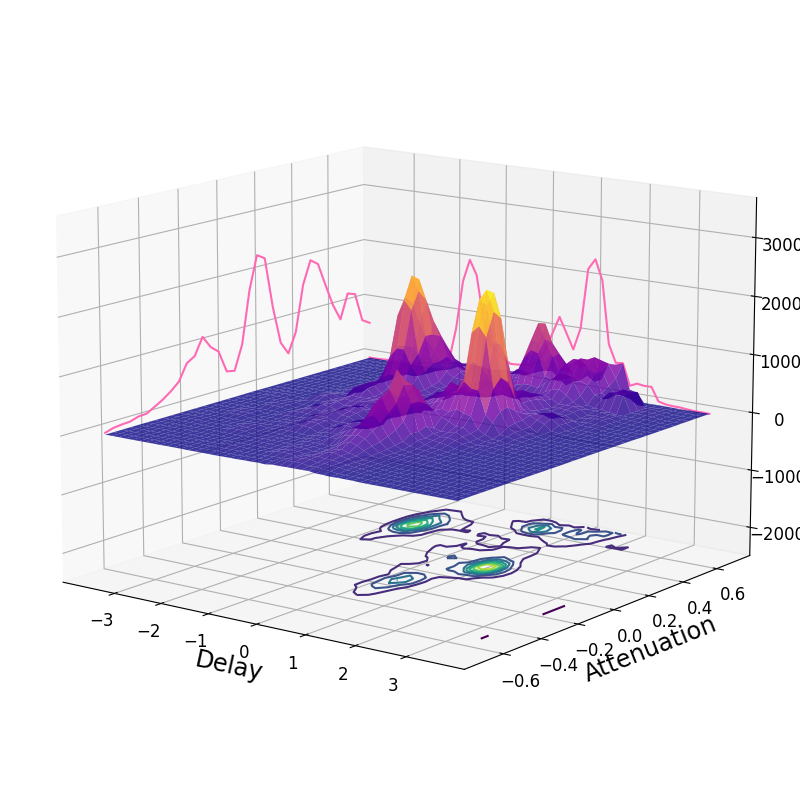

# DUET Sound Seperation Algorithm

Python code that implements the DUET blind source separation algorithm.

MATLAB code from here - https://github.com/yvesx/casa495, which in turn was based on [The_DUET_blind_source_separation_algorithm](https://www.researchgate.net/publication/227143748_The_DUET_blind_source_separation_algorithm)

The references are credited below, and refactored some blocks of code to speed up. The peaks detection method is took from [here](https://github.com/nussl/nussl/blob/471e7965c5788bff9fe2e1f7884537cae2d18e6f/nussl/core//utils.py#L49).
All the sound files present it in the Data folder are credited to the original casa495 project.

# Credits:

1. Scott Rickard
2. harmeet88523
3. bhargavvader
4. NareshPeshwe

# References

1. [CASApythonPort duet](https://github.com/bhargavvader/CASApythonPort)
2. [nussl duet](https://github.com/nussl/nussl/blob/master/nussl/separation/spatial//duet.py#L9)

# Demo

```python
import numpy as np
from bss import Duet
from scipy.io.wavfile import read, write
# x is stereo(2 channels)
fs, x = read("<FILEDIR>/x.wav")
x = np.transpose(x)
duet = Duet(x, n_sources=5, sample_rate=fs)
estimates = duet()
duet.plot_atn_delay_hist()
for i in range(duet.n_sources):
    write(f"output{i}.wav", duet.fs, estimates[i, :]+0.05*duet.x1)
```



# Performance

```
         1015 function calls (1003 primitive calls) in 0.192 seconds

   Ordered by: internal time

   ncalls  tottime  percall  cumtime  percall filename:lineno(function)
        1    0.063    0.063    0.068    0.068 bss.py:387(_convert_peaks)
        1    0.060    0.060    0.081    0.081 bss.py:421(_build_masks)
        1    0.012    0.012    0.012    0.012 bss.py:274(_compute_atn_delay)
        ...
```
